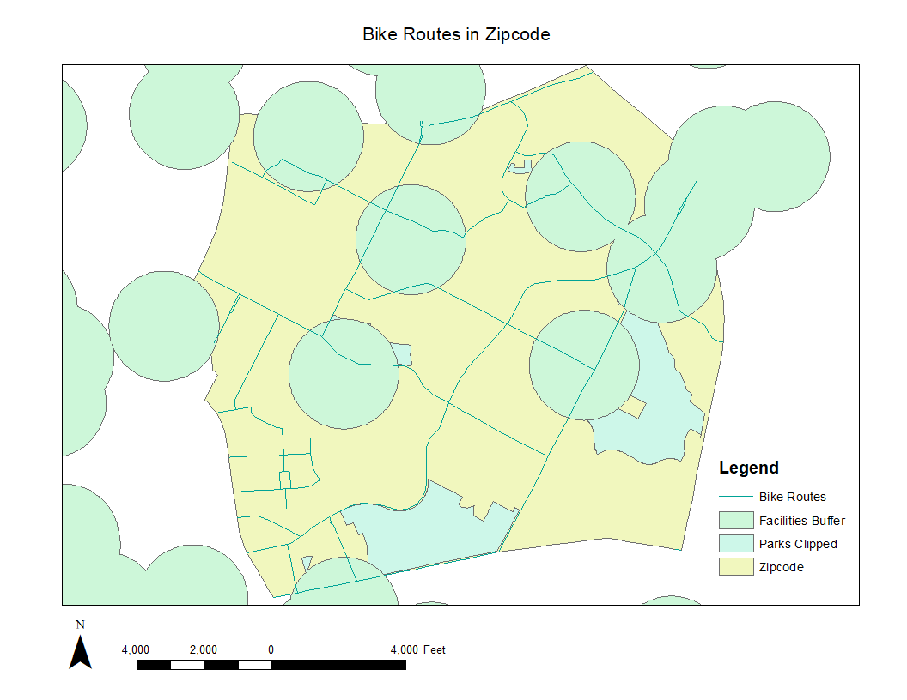

# LAB 2: GEOPROCESSING USING ArcPy
Author: Claire Morehouse

Due: 30 October 2020

## Description
Contents of this repo are the script Lab2Geoprocessing and a map created from the output of that script (scene below). 

This script runs two clips and a buffer in ArcMap 10.7. A clip "cookie-cuts" a shapefile using another shapefile. A buffer creates a buffer around a shapefile depending on the length one specifies. The goal of this script was to clip parks and bikes such that only the portion in what zipcode are shown in the map, as well as create dissolved (no overlapping edges) buffers around facilities. The inputs for the first clip are the shapefile parks and the zip shapefile. The output is a clipped parks file of only the parks in that shapefile. This script also sets a workspace to a particular folder. The buffer inputs are the facilities, and the output are buffers 500 metters around the point feature facilities. This script also creates dissolved buffers. Finally, this script clips the bike route shapefile with the zip shapefile to create a shapefile of the bike routes only in the shapefile.

Final map scene below with clipped parks, bike routes, dissolved buffers, and the zipcode. 

